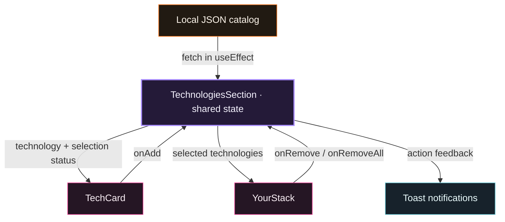

<a id="top"></a>

<table>
<tr>
<td width="58%" valign="middle">
  
  <br /><br />
  <sub>A TOOLKIT FOR YOUR NEXT IDEA</sub>
  <h1>Build a stack.<br />Make it yours.</h1>
  <p>Explore the tools. Find your fit.<br />Bring your development stack together.</p>
  <br />
  <a href="#getting-started"><strong>Get started ↗</strong></a> &nbsp;&nbsp;
  <a href="https://github.com/SamaunRezvi/assignment_five"><strong>Explore the code ↗</strong></a>
  <br /><br />
  <sub>REACT &nbsp; / &nbsp; VITE &nbsp; / &nbsp; TAILWIND CSS</sub>
</td>
<td width="42%" align="center" valign="middle">
  
</td>
</tr>
</table>

<div align="center">


<sub><strong>15</strong> TECHNOLOGIES &nbsp;&nbsp; / &nbsp;&nbsp; <strong>07</strong> CATEGORIES &nbsp;&nbsp; / &nbsp;&nbsp; <strong>01</strong> PERSONAL STACK</sub>

<br /><br />

<a href="#about-the-project">Overview</a> &nbsp; · &nbsp;
<a href="#the-experience">Experience</a> &nbsp; · &nbsp;
<a href="#under-the-hood">Architecture</a> &nbsp; · &nbsp;
<a href="#getting-started">Setup</a> &nbsp; · &nbsp;
<a href="#react-questions">React Q&amp;A</a> &nbsp; · &nbsp;
<a href="#submission">Submission</a>

</div>

<br />

## About the Project

**Dev Stack Builder brings your technology choices into one place.**

Browse a catalog of development tools, explore what each one offers and collect your choices in a personal stack. The interface pairs a 3D illustration with a warm orange, pink and violet palette, clear technology cards and a live selection panel.

Built with React, this project focuses on a complete selection flow: loading data, adding tools, preventing duplicates, updating the count and removing selections with immediate feedback.

## The Experience

<table>
<tr>
<td width="33%" valign="top">
  <sub>01 / EXPLORE</sub>
  <h3>Find your tools.</h3>
  <p>Browse 15 technologies across 7 categories. Each card brings together an icon, description, badge, difficulty level and rating.</p>
</td>
<td width="34%" valign="top">
  <sub>02 / ASSEMBLE</sub>
  <h3>See it take shape.</h3>
  <p>Add a technology to Your Stack. The panel and selected count update immediately, while the card reflects your choice.</p>
</td>
<td width="33%" valign="top">
  <sub>03 / REFINE</sub>
  <h3>Keep what fits.</h3>
  <p>Remove one tool or clear the stack and start again. Toast notifications confirm changes along the way.</p>
</td>
</tr>
</table>

### Small details that matter

| Detail | What you see |
| :--- | :--- |
| Selection feedback | Added cards display their selected state and disable the add button. |
| Duplicate protection | The add handler checks for existing selections before updating the stack. |
| Empty state | A clear placeholder appears before the first selection and after the last removal. |
| Loading state | A spinner appears while the technology catalog loads. |
| Responsive layout | The catalog and stack panel adapt to mobile, tablet and desktop screens. |
| Mobile navigation | A collapsible menu provides access to the navigation links on smaller screens. |

> **Session behavior:** Selections live in React state. Refreshing the page starts a fresh stack.

## Tech Stack

<p>
  
  
  
  
</p>

| Technology | Responsibility |
| :--- | :--- |
| React 18 | Component composition, selection state and UI updates |
| Vite 6 | Development server and production build |
| Tailwind CSS 3 | Responsive layout, spacing, typography and brand colors |
| DaisyUI | Loading spinner styling |
| React Toastify | Add, remove, clear and duplicate warning notifications |
| Local JSON | Technology catalog fetched when the section mounts |

<details>
<summary><strong>Explore all 15 technologies</strong></summary>

<br />

| Category | Technologies |
| :--- | :--- |
| Frontend | React, Vue.js, Svelte, Next.js |
| Backend | Node.js |
| Database | PostgreSQL, Redis, MongoDB |
| Language | JavaScript, TypeScript, Java |
| Styling | Tailwind CSS |
| DevOps | Docker |
| Tools | Git, Vite |

</details>

## Under the Hood

`TechnologiesSection` owns the catalog, loading flag and selected stack. It supplies data and callbacks to the cards and stack panel, keeping both views connected to the same state.



<details>
<summary><strong>Project structure</strong></summary>

```text
public/
  data/technologies.json
src/
  assets/
    banner-stack.png
    logo-text.png
  components/
    Navbar.jsx
    Hero.jsx
    TechnologiesSection.jsx
    TechCard.jsx
    YourStack.jsx
    Footer.jsx
  App.jsx
  index.css
  main.jsx
```

</details>

## Getting Started

From the project folder, with Node.js and npm installed:

```bash
npm install
npm run dev
```

Open the local URL shown in the terminal, usually `http://localhost:5173`.

| Task | Command |
| :--- | :--- |
| Start development | `npm run dev` |
| Build for production | `npm run build` |
| Preview the build | `npm run preview` |
| Run ESLint | `npm run lint` |

## React Questions

Seven concepts behind the interface, with examples from this project.

| No. | Concept | In this project |
| :--- | :--- | :--- |
| 01 | [JSX](#q1-jsx) | Describing cards and panels |
| 02 | [Props and state](#q2-props-and-state) | Sharing the selected stack |
| 03 | [useState](#q3-usestate) | Storing selections and menu state |
| 04 | [useEffect](#q4-useeffect) | Loading the technology catalog |
| 05 | [List keys](#q5-list-keys) | Identifying cards and stack items |
| 06 | [Conditional rendering](#q6-conditional-rendering) | Showing the empty stack |
| 07 | [Component communication](#q7-component-communication) | Connecting buttons to parent state |

<a id="q1-jsx"></a>

### 1. What is JSX, and why is it used in React?

JSX is a syntax extension for JavaScript that lets us write markup inside a component. A build tool transforms it into JavaScript calls that describe React elements. It makes the UI easier to read because the markup and the expressions used to display data can stay together. In this project, the technology cards and stack panel are written with JSX.

<a id="q2-props-and-state"></a>

### 2. What is the difference between props and state?

Props are values a parent passes to a child component. The child reads them without changing them directly. State is data a component stores and updates, and updating it asks React to render the UI again. Here, `TechnologiesSection` owns the `stack` state and passes it to `YourStack` as a prop.

<a id="q3-usestate"></a>

### 3. What does the `useState` hook do, and where did you use it in this project?

`useState` stores a value between renders and provides a function to update it. In `TechnologiesSection.jsx`, it holds the fetched technologies, the loading flag and the selected stack. In `Navbar.jsx`, it stores whether the mobile menu is open.

```jsx
const [stack, setStack] = useState([])
```

<a id="q4-useeffect"></a>

### 4. What does the `useEffect` hook do, and why did you need it to load the JSON data?

`useEffect` runs an effect after React commits a render. In this project, it fetches `/data/technologies.json` and updates the technology list and loading state when the request completes. The empty dependency array means the effect does not run again for ordinary state updates. React Strict Mode can run an extra setup cycle during development.

<a id="q5-list-keys"></a>

### 5. Why does every item in a `.map()` list need a unique `key` prop?

A stable key helps React match a list item with the same item on the next render, even when items are added or removed. Keys should be unique among siblings. This project uses each technology's `id` as the key for both technology cards and selected stack items.

<a id="q6-conditional-rendering"></a>

### 6. What is conditional rendering? Show one place you used it (example: the empty stack message).

Conditional rendering chooses which UI to show based on a condition. In `YourStack.jsx`, `stack.length === 0` shows the "Your stack is empty." placeholder. When the stack contains items, the component shows the selected technologies, their count and the **Remove All** button.

<a id="q7-component-communication"></a>

### 7. How do you pass data from a parent component to a child component, and how does a child send something back to the parent?

A parent passes data through props. It can also pass a callback function for the child to call when an action happens.

```jsx
<TechCard tech={tech} isAdded={isAdded} onAdd={handleAdd} />
```

In this example, `tech` and `isAdded` supply the card's data and selection status. Clicking **Add to Stack** calls `onAdd(tech)` inside `TechCard`. The parent's `handleAdd` function then updates the stack state in `TechnologiesSection`.

## Submission

| Resource | Link |
| :--- | :--- |
| GitHub Repository Link | [SamaunRezvi/assignment_five](https://github.com/SamaunRezvi/assignment_five) |
| Live Site Link | Not provided yet. |

<br />

<div align="center">


<p><sub>A place for your next stack.</sub></p>

<a href="#top"><sub>Back to top ↑</sub></a>

</div>
